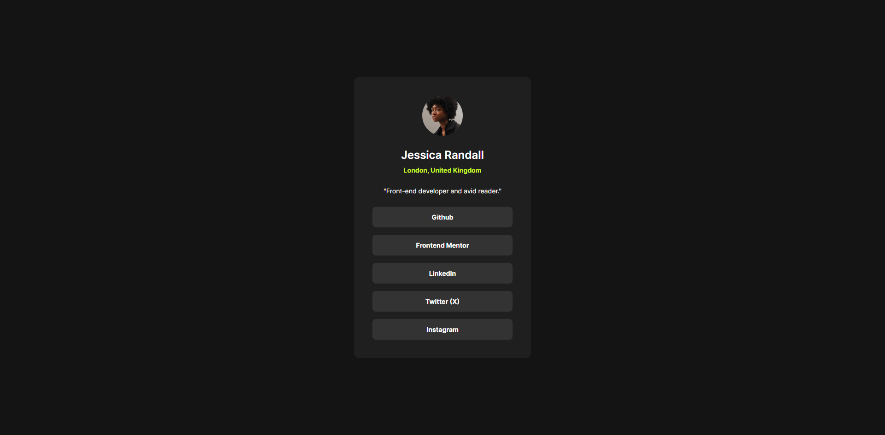
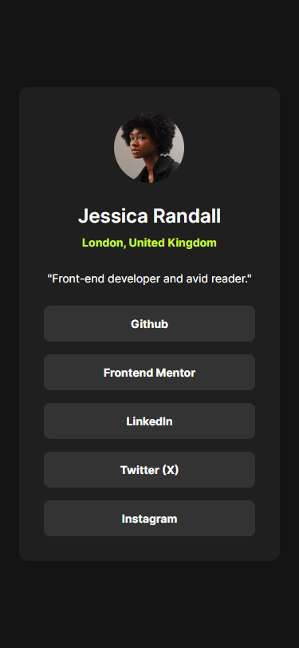

# Frontend Mentor - Social links profile solution

This is a solution to the [Social links profile challenge on Frontend Mentor](https://www.frontendmentor.io/challenges/social-links-profile-UG32l9m6dQ).

## Table of contents

- [Overview](#overview)
  - [The challenge](#the-challenge)
  - [Screenshot](#screenshot)
  - [Links](#links)
- [My process](#my-process)
  - [Built with](#built-with)
  - [Useful resources](#useful-resources)
- [Author](#author)

**Note: Delete this note and update the table of contents based on what sections you keep.**

## Overview

### The challenge

Users should be able to:

- See hover and focus states for all interactive elements on the page

### Screenshot

### Links

- [Solution URL](https://github.com/FilipKod/social-links-profile)
- [Live Site URL](https://social-links-filipkod.netlify.app/)

## My process

### Built with

- Semantic HTML5 markup
- CSS custom properties
- CSS Grid
- Mobile-first workflow

### Useful resources

- [Modern and simple css @font-face generator](https://transfonter.org/) - Tool for generate font-face and convert fonts to modern font format woff2
- [Font-size Clamp Generator](https://clamp.font-size.app/) - I use this tool for responsive card's padding

## Author

- LinkedIn - [Filip Madunicky](https://www.linkedin.com/in/madunickyfilip/)
- Frontend Mentor - [@FilipKod](https://www.frontendmentor.io/profile/FilipKod)
- Github - [FilipKod](https://github.com/FilipKod)
